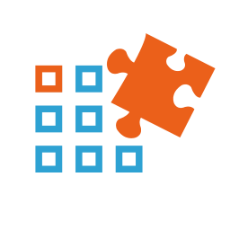
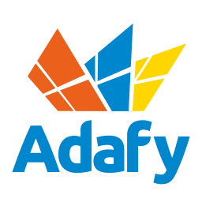

# Plugin Framework for .NET Core [](https://www.nuget.org/packages/Weikio.PluginFramework/)

With Plugin Framework for .NET Core, everything is a plugin! Plugin Framework is a **plugin platform** for .NET Core applications, including **ASP.NET Core, Blazor, WPF, Windows Forms and Console apps**. It is light-weight and easy to integrate and supports multiple different plugin catalogs, including .NET assemblies, **Nuget packages** and **Roslyn scripts**.

### Main Features 

Here are some of the main features of Plugin Framework: 

* Everything is a plugin! Deliver plugins as Nuget-packages, .NET assemblies, Roslyn scripts and more.
* Easy integration into a new or an existing .NET Core application.
* Automatic dependency management.
* Handles platform specific runtime DLLs and native DLLs when using Nuget-packages.
* MIT-licensed, commercial support available.

## Quickstart: Plugin Framework & ASP.NET Core

Plugin Framework is available from Nuget as a .NET Core 3.1 package. There's a separate package which makes it easier to work with plugins in an ASP.NET Core app:

[](https://www.nuget.org/packages/Weikio.PluginFramework.AspNetCore/)

```
Install-Package Weikio.PluginFramework.AspNetCore
```

Using Plugin Framework can be as easy as adding a single new line into ConfigureServices:

```
services.AddPluginFramework<IOperator>(@".\myplugins");
```

The code finds all the plugins (types that implement the custom IOperator-interface) from the myplugins-folder. The plugins can be used in a controller using constructor injection:

```
public CalculatorController(IEnumerable<IOperator> operator)
{
	_operators = operators;
}
```

Alternatively, you can provide multiple plugin locations using catalogs:

```
var folderPluginCatalog = new FolderPluginCatalog(@".\myplugins", type =>
{
    type.Implements<IOperator>();
});

var anotherPluginCatalog = new FolderPluginCatalog(@".\morePlugins", type =>
{
    type.Implements<IOperator>();
});

services.AddPluginFramework()
    .AddPluginCatalog(folderPluginCatalog)
    .AddPluginCatalog(anotherPluginCatalog)
    .AddPluginType<IOperator>();
```

## Samples

The following Plugin Framework samples are available from GitHub:

#### [Plugin Framework & .NET Console Application](https://github.com/weikio/PluginFramework/tree/master/samples/ConsoleApp)

#### [Plugin Framework & ASP.NET Core](https://github.com/weikio/PluginFramework/tree/master/samples/WebApp)

#### [Plugin Framework & Blazor](https://github.com/weikio/PluginFramework/tree/master/samples/BlazorApp)

#### [Plugin Framework & WPF App](https://github.com/weikio/PluginFramework/tree/master/samples/WpfApp)

#### [Plugin Framework & WinForms App](https://github.com/weikio/PluginFramework/tree/master/samples/WinFormsApp)

#### [Nuget & Plugin Framework & ASP.NET Core](https://github.com/weikio/PluginFramework/tree/master/samples/WebAppWithNuget)

#### [Roslyn & Plugin Framework & ASP.NET Core](https://github.com/weikio/PluginFramework/tree/master/samples/WebAppWithRoslyn)

#### [Delegates & Plugin Framework & ASP.NET Core](https://github.com/weikio/PluginFramework/tree/master/samples/WebAppWithDelegate)

#### [Tagging & WinForms App](https://github.com/weikio/PluginFramework/tree/master/samples/WinFormsApp)

#### [AppSettings.json & ASP.NET Core](https://github.com/weikio/PluginFramework/tree/master/samples/WebAppWithAppSettings)

## Background and introduction

For more details related to Plugin Framework's background, please see the following [introduction article from InfoQ](https://www.infoq.com/articles/Plugin-Framework-DotNet/).

## Main concepts

Using Plugin Framework concentrates around two concepts: **Plugins** and **Plugin Catalogs**.

### Plugin

Plugins are software programs, which provide extensions to an application. Plugins are designed to work with a single application. This app is often called the **host application**. The host application is designed in such a way that it can locate and run plugins dynamically, runtime. **The application works without the plugins, the plugins can't work without the host application.**

The host application defines the specifications for the plugins. In some applications a plugin can add new functionality into the UI. In other apps, plugins are used to distribute logs into multiple different systems. The host application defines what kind of extensions it supports.

Plugin-based software architecture can help in the following scenarios:

* Adding new features to application after the release
* Splitting large systems into smaller parts
* Updating always-on software system without restarting it

Plugins are dynamic, and they are often only loaded when the application needs them. Plugins are not usually compiled as part of the system but distributed as separate packages (assemblies, Nuget packages).

In the context of the Plugin Framework, **plugin is a single .NET Type**. What makes a plugin? As described previously, it depends on the host application. For some applications a plugin is a type which implements a specific interface. In some applications a plugin is a type which has a single public method called Run. Attributes are often used to indicate the plugins and that is also supported by Plugin Framework. From the Plugin Framework's point of view anything or everything can be a plugin. 

As mentioned, in Plugin Framework a single plugin is a .NET Type. Even though Plugin Framework's ASP.NET Core support makes it easy to instantiate and use plugins in services and controllers through dependency injection (IServiceProvider), Plugin Framework itself doesn't provide any built-in mechanisms for creating instances (objects) from the plugins (types). In some cases Activator.CreateInstance is all that is needed and in some cases it is best to hook Plugin Framework with the app's DI-system. The requirements are host application specific.

In Plugin Framework, each Plugin is composed of the following information:
* Type
* Plugin name
* Plugin version

### Plugin Catalogs

Plugin Framework contains a concept called "Catalog". A single assembly can be a catalog. A .NET type can be a catalog. Folders with dlls are often used as catalogs and Plugin Framework also supports Nuget packages, Nuget feeds and Roslyn scripts as Plugin catalogs. Multiple catalogs are often combined into a single Composite catalog.

Each catalog contains 0-n plugins. 

Plugin Framework provides the following officially supported catalogs:

* Type
* Assembly
* Folder
* Delegate (Action or a Func) ([Documentation](https://github.com/weikio/PluginFramework/wiki/Delegate-Plugin-Catalog))
* Roslyn script ([Nuget: Weikio.PluginFramework.Catalogs.Roslyn](https://www.nuget.org/packages/Weikio.PluginFramework.Catalogs.Roslyn/), [Documentation](https://github.com/weikio/PluginFramework/wiki/Roslyn-Plugin-Catalog))
* Nuget package ([Nuget: Weikio.PluginFramework.Catalogs.Nuget](https://www.nuget.org/packages/Weikio.PluginFramework.Catalogs.Nuget/))
* Nuget feed ([Nuget: Weikio.PluginFramework.Catalogs.Nuget](https://www.nuget.org/packages/Weikio.PluginFramework.Catalogs.Nuget/))

## Source code

Source code for Plugin Framework is available from [GitHub](https://github.com/weikio/PluginFramework).

## Support & Build by

Plugin Framework is build by [Adafy](https://adafy.com). Adafy also provides commercial support for the framework.



Adafy is a Finnish software development house, focusing on Microsoft technologies.

## Constributors

Thanks to the following contributors who have helped with the project:

#### [@panoukos41](https://github.com/panoukos41)

## License

Plugin Framework is available as an open source, MIT-licensed project. 